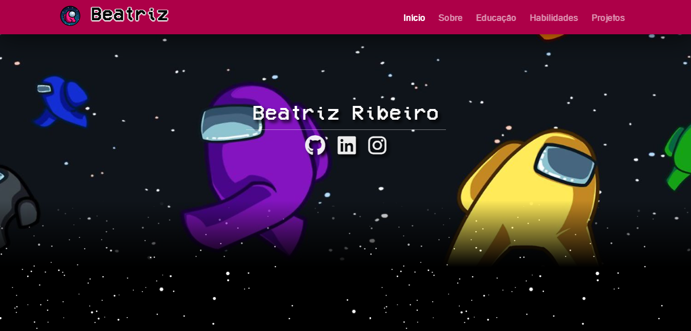

<h2> </h2>

Portfólio realizado como projeto final para a matéria de PWEB (Programação Web). No qual teria que escolher um tema de fantasia (filme, série, jogo, etc.) para utilizar na implementação do projeto, o tema escolhido foi o jogo Amung us. 

**Instituição:** Fatec Sorocaba.  
**Curso:** Análise e Desenvolvimento de Sistemas.  

     
      
     Para acessar o site clique <a href="https://portfolio-beatriz.netlify.app/">AQUI</a>.

<h2></h2>

### Tecnologias utilizadas:

     
     
     
     
     

